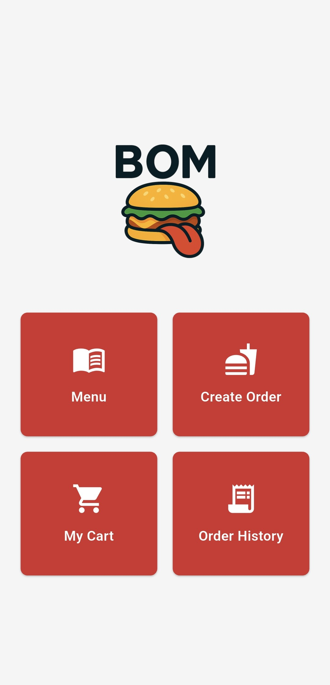
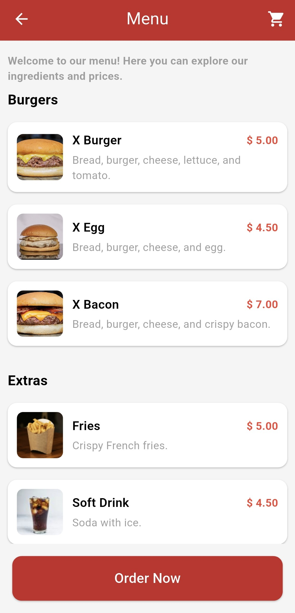
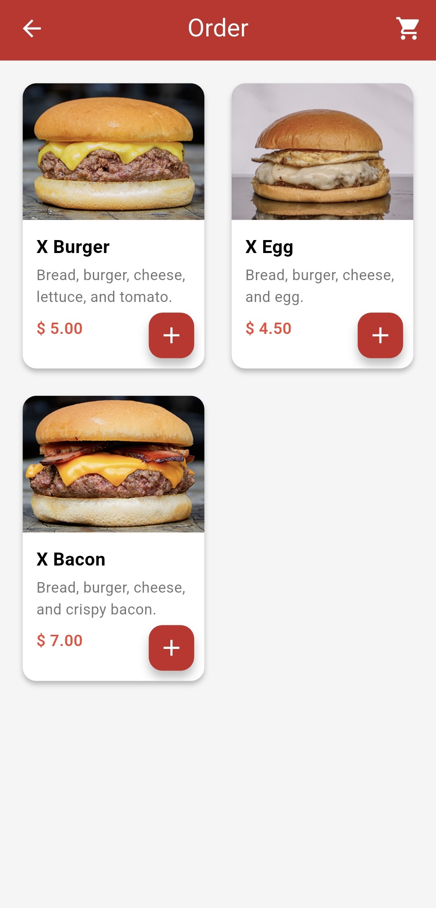
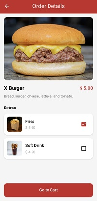
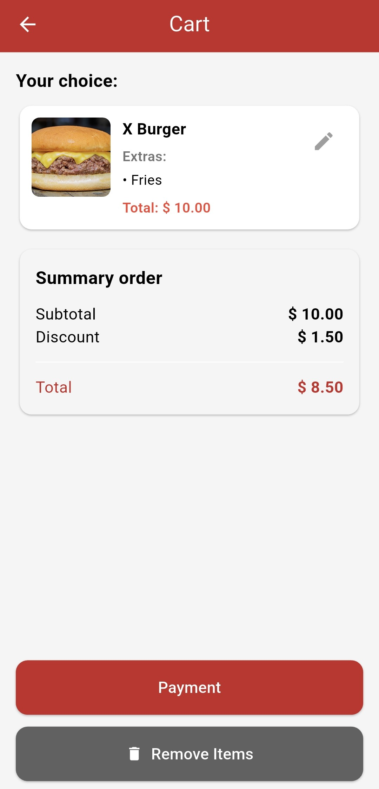

# 🍔 Bom Hamburguer

Aplicativo Flutter Bom Hamburguer para gerenciamento de pedidos, com carrinho, tela de pagamento e histórico de pedidos.

## 📌 Regras do Projeto

- Se  o  cliente  selecionar  um  sanduíche,  batata  frita  e  refrigerante,  ele  terá  20%  de  desconto.
- Se  o  cliente  selecionar  um  sanduíche  e  um  refrigerante,  ele  terá  15%  de  desconto.
- Se  o  cliente  selecionar  um  sanduíche  e  batatas  fritas,  ele  terá  um  desconto  de  10%.
- Cada  pedido  não  pode  conter  mais  de  um  sanduíche,  batata  frita  ou  refrigerante.  Se  dois  itens  idênticos  forem  
enviados,  o  APP  deverá  retornar  uma  mensagem  de  erro  com  o  motivo

## 🛠️ Requisitos do projeto

 1)  Crie  um  recurso  para  listar  todos  os  sanduíches  e  extras.
 2)  Crie  um  recurso  para  adicionar  um  sanduíche  ao  carrinho.
 3)  Crie  um  recurso  para  mostrar  o  carrinho  (todos  os  itens  selecionados  pelo  usuário)  e  exibir  quanto
 eles  precisam  pagar.
 4)  Crie  um  recurso  para  pagar  (pagamento  falso,  não  precisa  informar  nenhuma  fonte  de  pagamento)  e
 criar  um  pedido.
 a.  O  pagamento  requer  apenas  o  nome  do  cliente

---

## 📸 Telas do App

### Home


### Menu


### Order


### Order Details


### Cart


### Order History


---

## 🚀 Como executar o projeto

1. **Clone o repositório:**

```bash
git clone https://github.com/natashagerena/bom_hamburguer.git
cd bom_hamburguer
```

2. **Instale as dependências:**

```bash
flutter pub get
```

3. **Execute o app em modo debug:**

```bash
flutter run
```

---

## 📦 Como gerar o APK

1. **Verifique se há erros:**

```bash
flutter analyze
```

2. **Gere o APK:**

```bash
flutter build apk --release
```

3. O arquivo será gerado em:

```
build/app/outputs/flutter-apk/app-release.apk
```

Você pode transferi-lo para o celular e instalar.

---

## ✨ Autor

Natasha Gerena – [GitHub](https://github.com/natashagerena)
